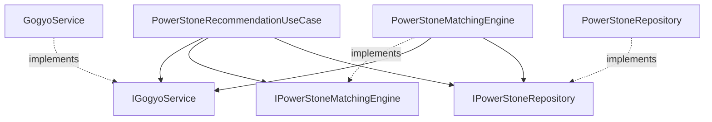

# Phase 2: 매칭 엔진 코어 설계서

> **Issue**: #2 — Phase 2: 매칭 엔진 코어 개발 (Core Engine)  
> **작성일**: 2026-03-03  
> **참조 문서**: [월단위 길방위·파워스톤 매칭 설계서](monthly-direction-with-powerstone.md)  
> **적용 원칙**: SRP, SSoT, OCP, DIP, DRY, ISP

---

## 1. 스코프 및 목표

산출된 길흉방위의 오행 정보를 바탕으로, 3-Layer 파워스톤 추천 엔진을 개발한다.

| Layer | 이름 | 입력 | 변동 주기 |
|-------|------|------|----------|
| **L1** | 기본석 (基本石) | 본명성 → 오행 | 평생 고정 |
| **L2** | 월운석 (月運石) | 최적 길방위 → 오행 | 매월 변동 |
| **L3** | 호신석 (護身石) | 최악 흉방위 → 상극 오행 | 매월 변동 |

최종 출력은 **항상 서로 다른 3개의 파워스톤**, 중복 회피 알고리즘을 포함한다.

---

## 2. 아키텍처 레이어 구조

```
┌─────────────────────────────────────────────────────────────────┐
│ Presentation Layer (routes/)                                     │
│   monthly_routes.py  ← 기존 /monthly/directions 에 stones 필드 추가 │
└────────────────────────────┬────────────────────────────────────┘
                             │ depends on
┌────────────────────────────▼────────────────────────────────────┐
│ Application Layer (use_cases/)                                    │
│   PowerStoneRecommendationUseCase  [NEW]                         │
│   MonthlyDirectionsUseCase         [기존 — 연계]                  │
└────────────────────────────┬────────────────────────────────────┘
                             │ depends on (interfaces only)
┌────────────────────────────▼────────────────────────────────────┐
│ Domain Layer (domain/)                                            │
│                                                                   │
│  services/                                                        │
│    GogyoService                       [NEW] 오행 판별·상극 유틸    │
│    PowerStoneMatchingEngine           [NEW] 3-Layer 매칭 엔진      │
│                                                                   │
│  services/interfaces/                                             │
│    IGogyoService                      [NEW]                       │
│    IPowerStoneMatchingEngine          [NEW]                       │
│    IPowerStoneRepository              [NEW]                       │
│                                                                   │
│  value_objects/                                                    │
│    Gogyo (Enum)                       [NEW] 木·火·土·金·水         │
│    GogyoRelation (Enum)               [NEW] 相生·相剋·比和         │
│    PowerStone (Frozen Dataclass)      [NEW]                       │
│    StoneRecommendation (Frozen DC)    [NEW]                       │
│    PowerStoneResult (Frozen DC)       [NEW] 3-Layer 결과 VO        │
│                                                                   │
│  exceptions.py                        [MODIFY] 예외 추가           │
│                                                                   │
└────────────────────────────┬────────────────────────────────────┘
                             │ depends on (interfaces only)
┌────────────────────────────▼────────────────────────────────────┐
│ Infrastructure Layer (infrastructure/)                             │
│   PowerStoneRepository               [NEW] JSON/CSV 기반 정적 데이터 │
└─────────────────────────────────────────────────────────────────┘
```

### 의존성 흐름 (DIP 준수)



> **DIP**: 유즈케이스와 도메인 서비스는 인터페이스(I~)에만 의존한다. 구현체는 DI 컨테이너(`dependency_module.py`)에서 바인딩한다.

---

## 3. Value Objects (불변 도메인 모델)

### 3-1. `Gogyo` (오행 Enum) — SSoT

```python
# domain/value_objects/gogyo.py
class Gogyo(str, Enum):
    """오행(五行) — 프로젝트 전체에서 유일한 오행 정의 (SSoT)."""
    WOOD  = "木"
    FIRE  = "火"
    EARTH = "土"
    METAL = "金"
    WATER = "水"
```

### 3-2. `GogyoRelation` (오행 관계 Enum)

```python
class GogyoRelation(str, Enum):
    SOJO  = "相生"   # 서로 도움 (생하는 관계)
    SOKOKU = "相剋"  # 서로 억제 (극하는 관계)
    HIWA   = "比和"  # 같은 오행
```

### 3-3. `PowerStone` (파워스톤 VO)

```python
@dataclass(frozen=True)
class PowerStone:
    """단일 파워스톤 정보 (불변)."""
    id: str               # "emerald", "garnet" 등 고유 식별자
    name_ko: str           # "에메랄드"
    name_ja: str           # "エメラルド"
    name_en: str           # "Emerald"
    gogyo: Gogyo           # 대응 오행
    is_primary: bool       # 해당 오행의 주석 여부
```

### 3-4. `StoneRecommendation` (레이어별 추천 결과 VO)

```python
@dataclass(frozen=True)
class StoneRecommendation:
    """단일 레이어의 추천 결과."""
    stone: PowerStone
    layer: str             # "基本石" | "月運石" | "護身石"
    gogyo: Gogyo           # 매칭에 사용된 오행
    reason: str            # 추천 사유 (한국어)
    direction: Optional[str] = None   # 관련 방위 (L2/L3)
    threat_mark: Optional[str] = None # 관련 흉살 (L3)
```

### 3-5. `PowerStoneResult` (최종 3-Layer 결과 VO)

```python
@dataclass(frozen=True)
class PowerStoneResult:
    """3-Layer 파워스톤 추천 최종 결과."""
    base_stone: StoneRecommendation      # L1 기본석
    monthly_stone: StoneRecommendation   # L2 월운석
    protection_stone: StoneRecommendation # L3 호신석
```

---

## 4. 도메인 서비스 상세 설계

### 4-1. `GogyoService` — 오행 판별·상극 유틸리티 (SRP)

> **책임**: 오행 관련 순수 비즈니스 로직만 담당. 외부 I/O 없음.

```python
# domain/services/gogyo_service.py
class GogyoService(IGogyoService):

    # ── 매핑 테이블 (SSoT) ──────────────────────
    STAR_TO_GOGYO: Final[Dict[int, Gogyo]] = {
        1: Gogyo.WATER, 2: Gogyo.EARTH, 3: Gogyo.WOOD,
        4: Gogyo.WOOD,  5: Gogyo.EARTH, 6: Gogyo.METAL,
        7: Gogyo.METAL, 8: Gogyo.EARTH, 9: Gogyo.FIRE,
    }

    DIRECTION_TO_GOGYO: Final[Dict[str, Gogyo]] = {
        "N": Gogyo.WATER, "NE": Gogyo.EARTH,
        "E": Gogyo.WOOD,  "SE": Gogyo.WOOD,
        "S": Gogyo.FIRE,  "SW": Gogyo.EARTH,
        "W": Gogyo.METAL, "NW": Gogyo.METAL,
    }

    # ── 상극 테이블 (SSoT) ──────────────────────
    # key 를 극하는(억제하는) 오행
    SOKOKU_TABLE: Final[Dict[Gogyo, Gogyo]] = {
        Gogyo.WATER: Gogyo.EARTH,   # 土剋水
        Gogyo.WOOD:  Gogyo.METAL,   # 金剋木
        Gogyo.FIRE:  Gogyo.WATER,   # 水剋火
        Gogyo.EARTH: Gogyo.WOOD,    # 木剋土
        Gogyo.METAL: Gogyo.FIRE,    # 火剋金
    }

    # ── 공개 메서드 ──────────────────────────────
    def star_to_gogyo(self, star_number: int) -> Gogyo: ...
    def direction_to_gogyo(self, direction: str) -> Gogyo: ...
    def get_relation(self, a: Gogyo, b: Gogyo) -> GogyoRelation: ...
    def get_counter_gogyo(self, target: Gogyo) -> Gogyo: ...
```

### 4-2. `PowerStoneMatchingEngine` — 3-Layer 매칭 엔진 (OCP)

> **책임**: 길흉방위 판정 결과와 오행 서비스를 조합하여 3개의 스톤을 결정.  
> **OCP**: 각 Layer 는 독립 private 메서드로 분리 → Layer 4(일운석) 추가 시 기존 로직 변경 불필요.

```python
# domain/services/powerstone_matching_engine.py
class PowerStoneMatchingEngine(IPowerStoneMatchingEngine):

    @inject
    def __init__(
        self,
        gogyo_service: IGogyoService,
        stone_repo: IPowerStoneRepository,
    ) -> None: ...

    def recommend(
        self,
        main_star: int,
        directions: Dict[str, Any],   # MonthlyDirections 결과
    ) -> PowerStoneResult:
        """3-Layer 추천 실행 (퍼사드 메서드)."""
        used_ids: Set[str] = set()

        base   = self._layer1_base_stone(main_star, used_ids)
        monthly = self._layer2_monthly_stone(main_star, directions, used_ids)
        protect = self._layer3_protection_stone(directions, used_ids)

        return PowerStoneResult(base, monthly, protect)

    # ── Layer 1: 기본석 ───────────────────────────
    def _layer1_base_stone(self, main_star: int, used: Set[str]) -> StoneRecommendation:
        """본명성 → 오행 → 기본석 결정."""
        ...

    # ── Layer 2: 월운석 ───────────────────────────
    def _layer2_monthly_stone(
        self, main_star: int, directions: Dict, used: Set[str]
    ) -> StoneRecommendation:
        """최적 길방위 선택 → 오행 → 월운석 결정."""
        ...

    # ── Layer 3: 호신석 ───────────────────────────
    def _layer3_protection_stone(
        self, directions: Dict, used: Set[str]
    ) -> StoneRecommendation:
        """최악 흉살 방위 → 상극 오행 → 호신석 결정."""
        ...

    # ── 중복 회피 ─────────────────────────────────
    def _pick_stone(self, gogyo: Gogyo, used: Set[str]) -> PowerStone:
        """주석 우선 선택, used 에 포함되면 부석으로 대체."""
        ...
```

#### Layer 2 최적 길방위 선택 알고리즘 (설계서 §4-1)

```
입력: directions (방위별 길흉 판정 결과)
  ↓
1. is_auspicious == True 인 방위 필터링
  ↓
2. 본명성과의 상성으로 정렬
   - GOOD(상생) > NEUTRAL(비화) > 기타
  ↓
3. 동순위 → 방위 고정 우선순위: S > E > SE > SW > N > W > NE > NW
  ↓
4. 1순위 방위의 오행 → 월운석 오행으로 확정
```

#### Layer 3 최악 흉살 선택 알고리즘 (설계서 §5)

```
입력: directions (방위별 흉살 marks)
  ↓
1. 흉살 위험도 순위표로 각 방위의 최대 위험도 산출
   五黄殺(1) > 暗剣殺(2) > 本命殺(3) > 月命殺(4) > ...
  ↓
2. 가장 위험한 방위의 오행 확인
  ↓
3. 상극(相剋) 테이블로 억제 오행 결정
  ↓
4. 억제 오행의 주석 → 호신석으로 확정 (중복 시 부석 대체)
```

---

## 5. 인터페이스 정의 (ISP 준수)

각 인터페이스는 **최소한의 메서드**만 노출한다.

```python
# domain/services/interfaces/gogyo_service_interface.py
class IGogyoService(ABC):
    @abstractmethod
    def star_to_gogyo(self, star_number: int) -> Gogyo: ...
    @abstractmethod
    def direction_to_gogyo(self, direction: str) -> Gogyo: ...
    @abstractmethod
    def get_relation(self, a: Gogyo, b: Gogyo) -> GogyoRelation: ...
    @abstractmethod
    def get_counter_gogyo(self, target: Gogyo) -> Gogyo: ...
```

```python
# domain/services/interfaces/powerstone_matching_engine_interface.py
class IPowerStoneMatchingEngine(ABC):
    @abstractmethod
    def recommend(self, main_star: int, directions: Dict[str, Any]) -> PowerStoneResult: ...
```

```python
# domain/services/interfaces/powerstone_repository_interface.py
class IPowerStoneRepository(ABC):
    @abstractmethod
    def get_primary_by_gogyo(self, gogyo: Gogyo) -> PowerStone: ...
    @abstractmethod
    def get_secondaries_by_gogyo(self, gogyo: Gogyo) -> List[PowerStone]: ...
    @abstractmethod
    def get_base_stone_for_star(self, star_number: int) -> PowerStone: ...
```

---

## 6. 예외 클래스 추가 (기존 계층 확장)

```python
# domain/exceptions.py  [MODIFY]

class PowerStoneMatchingError(NineStarKiError):
    """파워스톤 매칭 과정에서 발생하는 오류."""
    def __init__(self, message="파워스톤 매칭 오류", *, details=None):
        super().__init__(message, code="POWERSTONE_MATCHING_ERROR", status=500, details=details)

class NoAuspiciousDirectionError(NineStarKiError):
    """길방위가 하나도 없어 월운석을 결정할 수 없는 경우."""
    def __init__(self, message="길방위를 찾을 수 없습니다.", *, details=None):
        super().__init__(message, code="NO_AUSPICIOUS_DIRECTION", status=422, details=details)
```

---

## 7. DI 바인딩 (`dependency_module.py`)

```python
# [MODIFY] dependency_module.py — Phase 2 추가 바인딩
binder.bind(IGogyoService, to=GogyoService, scope=singleton)
binder.bind(IPowerStoneMatchingEngine, to=PowerStoneMatchingEngine, scope=singleton)
binder.bind(IPowerStoneRepository, to=PowerStoneRepository, scope=singleton)
binder.bind(PowerStoneRecommendationUseCase, to=PowerStoneRecommendationUseCase, scope=singleton)
```

> ⚠️ **CODE_REVIEW_GUIDELINES §D2 준수**: 인터페이스 키로만 바인딩, 구상 클래스 직접 바인딩 금지.

---

## 8. 파일 구조 (신규/수정 대상)

```
backend/apps/ninestarki/
├── domain/
│   ├── value_objects/               [NEW 디렉토리]
│   │   ├── __init__.py
│   │   ├── gogyo.py                 ← Gogyo, GogyoRelation Enum
│   │   └── powerstone.py           ← PowerStone, StoneRecommendation, PowerStoneResult
│   ├── services/
│   │   ├── gogyo_service.py         [NEW] 오행 판별·상극 서비스
│   │   ├── powerstone_matching_engine.py  [NEW] 3-Layer 매칭 엔진
│   │   └── interfaces/
│   │       ├── gogyo_service_interface.py           [NEW]
│   │       ├── powerstone_matching_engine_interface.py [NEW]
│   │       └── powerstone_repository_interface.py   [NEW]
│   ├── repositories/                [기존]
│   └── exceptions.py               [MODIFY] 2개 예외 추가
├── infrastructure/
│   └── powerstone_repository.py     [NEW] JSON 기반 정적 데이터 구현체
├── use_cases/
│   └── powerstone_recommendation_use_case.py  [NEW]
├── routes/
│   └── monthly_routes.py            [MODIFY] stones 필드 추가
├── dependency_module.py             [MODIFY] DI 바인딩 추가
└── data/
    └── powerstone_catalog.json      [NEW] 스톤 마스터 데이터
```

---

## 9. 데이터 설계 — `powerstone_catalog.json`

정적 JSON 파일로 스톤 마스터 데이터를 관리한다 (DB 테이블 불필요).

```json
{
  "stones": [
    {
      "id": "aquamarine",
      "name_ko": "아쿠아마린",
      "name_ja": "アクアマリン",
      "name_en": "Aquamarine",
      "gogyo": "水",
      "is_primary": true
    },
    {
      "id": "lapis_lazuli",
      "name_ko": "라피스라즐리",
      "name_ja": "ラピスラズリ",
      "name_en": "Lapis Lazuli",
      "gogyo": "水",
      "is_primary": false
    }
  ],
  "star_base_stones": {
    "1": "aquamarine", "2": "citrine",     "3": "emerald",
    "4": "peridot",    "5": "tigers_eye",  "6": "clear_quartz",
    "7": "rose_quartz","8": "smoky_quartz","9": "garnet"
  }
}
```

> **SSoT**: 스톤-오행 매핑, 본명성-기본석 매핑 모두 이 파일이 단일 원천.

---

## 10. 테스트 전략

| 대상 | 테스트 유형 | 파일 |
|------|-----------|------|
| `GogyoService` | 단위 (순수 로직) | `test_gogyo_service.py` |
| `PowerStoneMatchingEngine` | 단위 (Stub 주입) | `test_powerstone_matching_engine.py` |
| `PowerStoneRecommendationUseCase` | 통합 (Stub 주입) | `test_powerstone_recommendation_use_case.py` |
| 중복 회피 | 단위 (엣지 케이스) | `test_powerstone_matching_engine.py` |

### 핵심 테스트 케이스

```
[GogyoService]
- star_to_gogyo: 1~9 전체 매핑 확인
- get_counter_gogyo: 5가지 상극 쌍 검증
- get_relation: 상생/상극/비화 각 1건 이상

[PowerStoneMatchingEngine]
- L1: 본명성 1~9 에 대해 각각 올바른 기본석 반환
- L2: 길방위가 없는 경우 → NoAuspiciousDirectionError 발생
- L2: 길방위 중 상성 GOOD 인 방위가 우선 선택됨
- L3: 五黄殺 > 暗剣殺 우선순위 확인
- 중복: L1=에메랄드(木), L2 후보도 木(주석=에메랄드) → 부석 대체 확인
- 중복: L1·L2·L3 에서 3개 전부 같은 오행 → 부석[0], 부석[1] 순차 대체
```

---

## 11. 클린 아키텍처 원칙 점검표

| 원칙 | 적용 | 설계 근거 |
|------|------|----------|
| **SRP** | `GogyoService`(오행 로직) ↔ `PowerStoneMatchingEngine`(매칭 전략) 분리 | 단일 책임 |
| **OCP** | Layer별 private 메서드 분리 → Layer 4 추가 시 기존 코드 수정 불필요 | 확장 개방 |
| **DIP** | 유즈케이스/도메인 서비스는 인터페이스(I~)에만 의존 | 의존성 역전 |
| **ISP** | 인터페이스별 최소 메서드만 노출 (예: `IGogyoService` 4개 메서드) | 인터페이스 분리 |
| **DRY** | 오행 매핑·상극 테이블은 `GogyoService` 에 SSoT 로 단일 정의 | 반복 제거 |
| **SSoT** | 스톤 데이터 → `powerstone_catalog.json`, 오행 매핑 → `GogyoService` | 단일 진실 원천 |

---

## 12. 구현 순서 (의존성 기반)

```
Step 1: Value Objects (gogyo.py, powerstone.py)
    ↓    ── 의존성 없음, 단독 테스트 가능
Step 2: GogyoService + IGogyoService + 단위 테스트
    ↓    ── Value Objects 에만 의존
Step 3: powerstone_catalog.json + PowerStoneRepository + IPowerStoneRepository
    ↓    ── Value Objects 에만 의존
Step 4: PowerStoneMatchingEngine + IPowerStoneMatchingEngine + 단위 테스트
    ↓    ── GogyoService, PowerStoneRepository 인터페이스에 의존
Step 5: 예외 클래스 추가 (exceptions.py)
    ↓
Step 6: PowerStoneRecommendationUseCase + 통합 테스트
    ↓
Step 7: DI 바인딩 + 라우트 연동 (dependency_module.py, monthly_routes.py)
```
